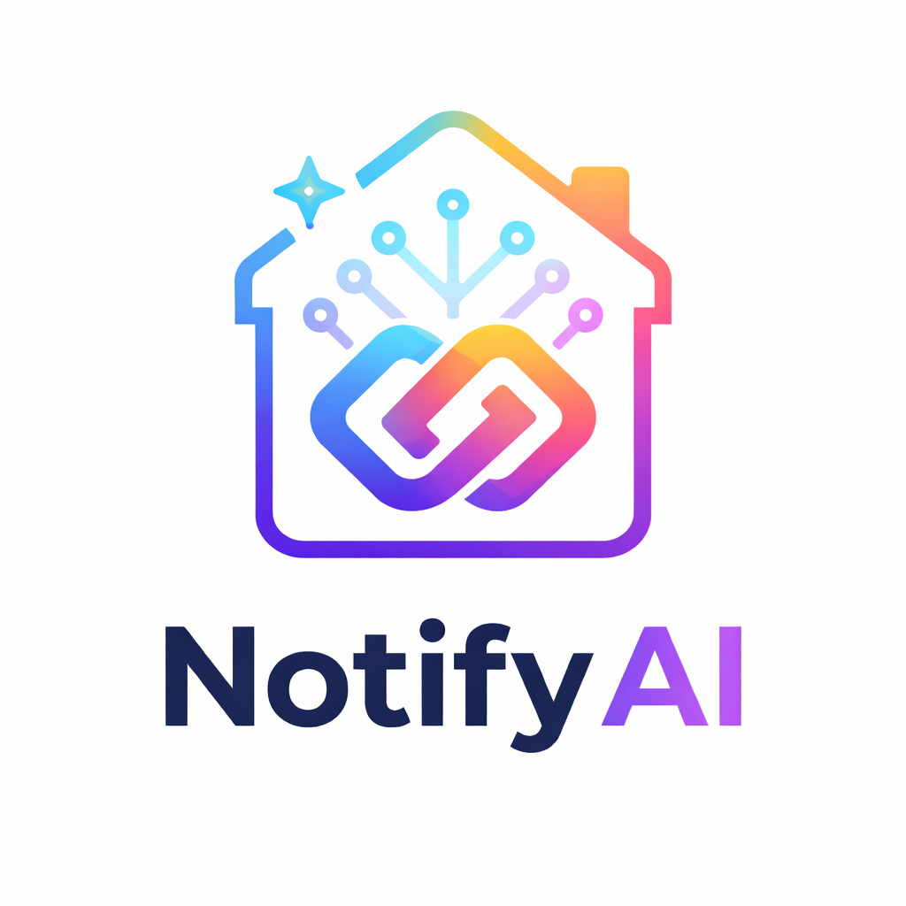

# NotifyAI - Home Assistant Entegrasyonu



[](https://github.com/hacs/integration)

Profesyonel yapay zeka destekli bildirim sistemi. Standart otomasyon uyarılarını akıllı, insan gibi ve **görsel olarak farkında** bildirimlere dönüştürür.

## 🌟 Özellikler
- **📸 Görsel Zeka**: Görsel gönderin, AI ne olduğunu görsün ("Kapıda kargocuyla paket var")
- **🎭 Karakterler**: Bir karakter tanımlayın (örn: `persona: "Jarvis"`)
- **📡 Çoklu Cihaz**: Ayarlarda 4 cihaza kadar tanımlayın
- **🇹🇷 Türkçe**: Tüm bildirimler Türkçe
- **⚡ Sıfır Bağımlılık**: Hiçbir dış kütüphane gerektirmez

## Kurulum

### HACS (Önerilen)
1. HACS > Entegrasyonlar > Özel Depolar
2. Bu repo URL'sini ekleyin: `https://github.com/ahamitd/notifyai`
3. "**NotifyAI**" arayın ve yükleyin
4. Home Assistant'ı yeniden başlatın

### Manuel
1. `custom_components/notifyai` klasörünü `config/custom_components/` içine kopyalayın
2. Home Assistant'ı yeniden başlatın

## Yapılandırma

1. **Ayarlar > Cihazlar & Hizmetler > Entegrasyon Ekle**
2. "**NotifyAI**" arayın
3. Google Gemini API Anahtarınızı girin ([Ücretsiz alın](https://aistudio.google.com/apikey))

## Kullanım

### Basit Örnek
```yaml
service: notifyai.generate
data:
  event: "Kapı açıldı"
  mode: "fun"
```

### Görsel Analiz
```yaml
service: notifyai.generate
data:
  event: "Kapıda biri var"
  image_path: "/config/www/doorbell.jpg"
```

### Özel Başlık
```yaml
service: notifyai.generate
data:
  event: "Hareket algılandı"
  custom_title: "🚨 Güvenlik Uyarısı"
  mode: "formal"
```

## Lisans
MIT License - Detaylar için [LICENSE](LICENSE) dosyasına bakın.
